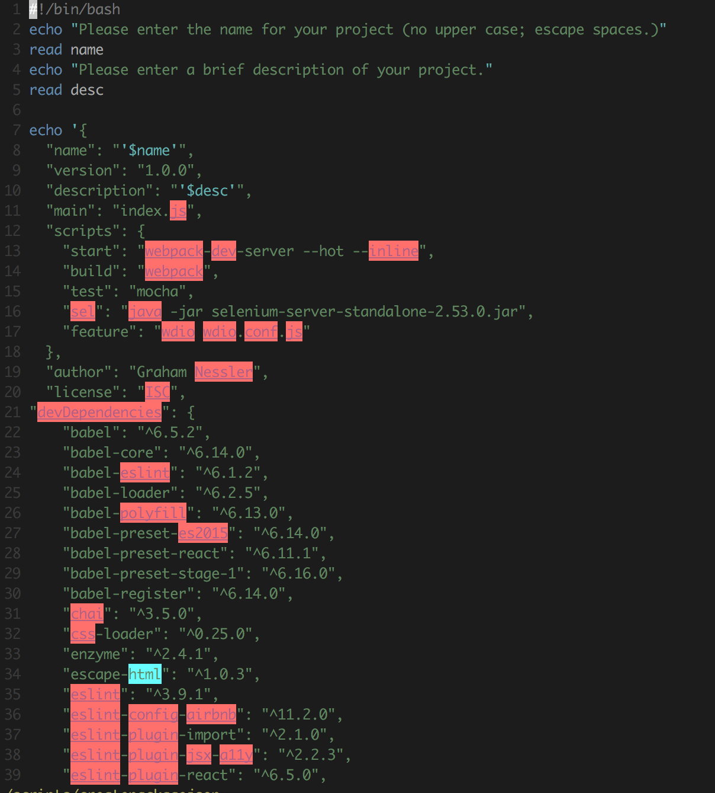
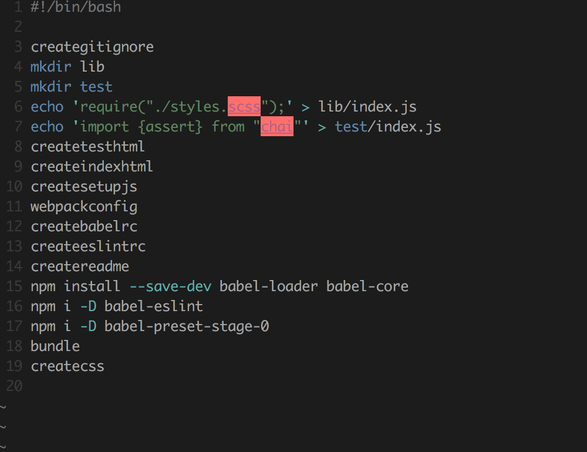

##Bash Scripts for Webpack Setup

This is a repo of Bash scripts meant to help developers set up Webpack more effectively. It stems from [a talk that I gave](https://gness1804.github.io/blog-in-react/) at a [January 2017 ReactJS meetup](https://www.meetup.com/ReactJS-Denver/events/236084764/) in Denver on the subject. (Slide deck is available [here](https://docs.google.com/presentation/d/1zdsfh6ut2TF5NOwfsC9LhXUiyQ_QXynoif1oVJV4MpQ/edit?usp=sharing)). 

Setting up Bash scripts to work on your machine is easy; see [this guide](http://ss64.com/osx/syntax-shellscript.html). Once this is set up, you can simply copy and paste the scripts into files with the same name in your `~/scripts` directory.

##Setup: 

I've included my Bash scripts in this repo. You can pick and choose among them as you see fit; what follows is a step by step guide to how I use these scripts to set up Webpack. All of the scripts are contained in the scripts directory in this repo. 

*Note: the following assumes you are creating a brand new project in a new repo.* 

* First, create your new directory for your new project and `cd` into it.
* If you have gotten all the scripts set up, you can simply **run the One Script to Rule them All**: `createwebpack`. This will take you through all the setup steps and prompt you for the appropriate information, such as the project name and initial readme text.

###If you'd like to know more what's going on under the hood: 

* `createwebpack` is itself composed of the following commands/scripts: 
  * `npm install`: initial installation 
  * `npm init`: the initial built-in setup for Webpack. Don't worry about any of the data here because this will just be overriden by `createpackagejson` anyway. 
  * `initialdep`: installs initial core dependencies such as mocha and chai (for testing) and webpack  
  * `createpackagejson`: As the name suggests, this creates your package.json (overriding the one created by `npm init`) and prompts you for info such as the project name, your name, and project description, and then populates this data into the package.json. This also includes a number of dependencies that you might need.  
  * `npm install`: installs the new dependencies created in your package.json  
  * `bigsetup`: runs a bunch of scripts and commands to set up your file structure, JS and CSS files, linting, etc. Explained more below.  
  * `npm run build`: builds Webpack by compiling your existing code into bundles that are read by the browser. 

####More about `bigsetup`: 

As you can see, there are many things going on in `bigsetup.` Here's a brief description of each line:

* `creategitignore`: creates a gitignore populated with standard items such as node_modules. 
* Makes a `lib` directory to store core files in, such as JS files. 
* Makes a `test` directory for test files. 
* Makes an `index.js` file with an import of the main stylesheet.
* Makes a test `index.js` with chai's `assert` reference imported. 
* `createtesthtml`: creates the main html file for tests.
* `createindexhtml`: creates the core `index.html` file in the root with the script tag to the `bundle` files built in. 
* `createsetupjs`: creates the `setup.js` test file in the test directory with core configuration (needed for React testing).
* `webpackconfig`: creates the `webpack.config.js` file with basic configuration 
* `createbabelrc`: creates the `babelrc` file to configure babel 
* `createeslintrc`: creates the `eslintrc` file with configuration settings for ESLint
* `createreadme`: creates the readme file with initial text based on user prompt 
* Installs babel-related dependencies to transpile ES6 to ES5.
* Also installs babel-related dependency. 
* Also installs babel-related dependency. 
* `bundle`: tells Webpack to compile `index.js` down to the `bundle.js` file. 
* `createcss`: creates css files (actually SASS files; SASS is included as a dependencies in `createpackagejson`) and populates them with `@import` statements so that they can talk to each other. This also includes a script called `createdebugscss` that creates a SASS debugging file (for instance, to give a `div` a temporary border if you are trying to position it or other elements relative to it).

Voila! These scripts will create a file structure and basic setup for Webpack right out of the box.
